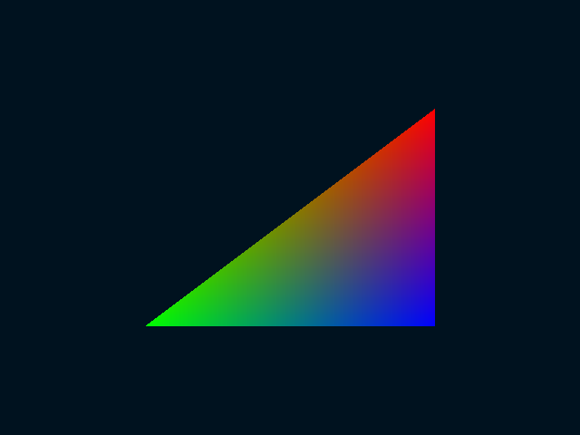

# Apogee

[](https://github.com/DreGi0/apogee/actions/workflows/build.yml)  
 


A [Kerbal Space Program](https://www.kerbalspaceprogram.com/) style like space flight game, built from scratch in C++20 with OpenGL and 
no game engine. It is a Personal project to explore real orbital mechanics and low-level graphics/physics 
programming, built as a portfolio piece.

> Built by one person learning graphics programming as they go, with an AI assistant (Claude) as a teacher 
> rather than a code dispenser and consulting on wikis and forums of people that might have already solved 
> something similar. The commit history is the actual learning curve, mistakes included.

## Status

Early development. Core windowing and OpenGL context are up (GLFW + GLAD), currently rendering a basic triangle. 
Next up: camera/transform pipeline, then orbital mechanics.

> Not playable yet, but I hope it will :).

## Tech Stack

[`C++20`](https://cppreference.com/cpp/20) | [`OpenGL 4.6 core`](https://www.opengl.org/) | [`GLFW`](https://www.glfw.org/) | [`GLAD`](https://glad.dav1d.de/) | [`CMake`](https://cmake.org/) | [`Docker`](https://www.docker.com/)
## Why These Choices
- **OpenGL instead of Vulkan:** Vulkan is the modern go to, lower-overhead option, and I looked hard at it. But 
a KSP-style game is more bounded by physics on the CPU, not by draw call overhead on the GPU, which by the way, 
**KSP itself famously chokes on single-threaded physics** while the GPU sits idle.
  <br><br>
- **A handwritten function loader first, then GLAD:** OpenGL is a specification, not a library: the system only 
exports the symbols frozen at OpenGL 1.1, and everything since has to be resolved at runtime through 
`glXGetProcAddress`. So I wrote the loader by hand first: 23 function pointers plus the typedefs and the enum 
values, specifically to understand that mechanism instead of calling a `gladLoadGL()` I would have treated as magic.
  <br><br>
Then I kind of get the hand of it, so I moved to GLAD. Adding a GL call had become copying a typedef into two files, 
which is more of a pain, so I switched to a generated GLAD. The handwritten version is still in the history 
([`gl_loader.cpp`](https://github.com/DreGi0/apogee/blob/40ecb7c/src/gl_loader.cpp)).
  <br><br>
- **Docker for the build:** It keeps the toolchain reproducible and made me work out X11 forwarding and GPU 
passthrough into a container, which was a good problem to have to solve. It also means anyone can build this 
without matching my setup. And because it made me feel like it was more professional LoL.
  <br><br>
- **No engine:** The point is to write the parts an engine would hide. I would say the main objective is 
to learn how actually a game works. PD: and why not to brag about it ;).

## Installation

Requires [Docker](https://docs.docker.com/get-docker/) and an X11 session.

> **Tip:** if `docker` asks for `sudo` every time, add yourself to the docker group with `sudo usermod -aG docker $USER` and log out and back in.

## Usage

```bash
git clone [https://github.com/DreGi0/apogee.git](https://github.com/DreGi0/apogee.git)
cd apogee
./run.sh
```

Opens a window rendering the current OpenGL scene. `ESC` closes it.

## Contributing

Not accepting pull requests at this stage. This is a solo portfolio project. Bug reports and 
suggestions are welcome via Issues.

## License

[PolyForm Noncommercial License 1.0.0](https://polyformproject.org/licenses/noncommercial/1.0.0)

## Gallery

### First Triangle



The first geometry ever rendered by this project: three vertices, each with its own color, pushed to 
the GPU through a hand configured VAO/VBO. The gradient is not something I drew, it is the rasterizer 
interpolating between the three vertex colors on its way to the fragment shader; which is just a fancy 
way of saying I made the corners red, green, and blue and the GPU did the rest. No matrices 
involved yet, the vertices are written straight in normalized device coordinates.